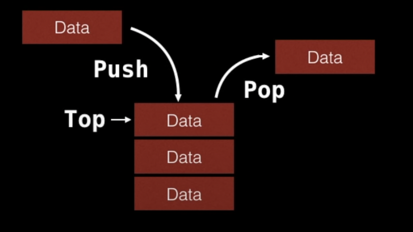
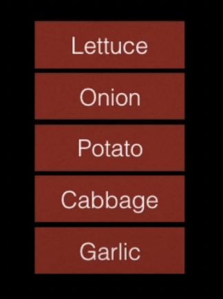

<center> 
<h1>Data Structures & Algorithms for Beginners - 2</h1> 
<h2></h2>
</center>

---

## A. Stack

A stack is a one-ended linear data structure which models a real world stack by having two primary operations, namely **push** and **pop**.



### 1. Instructions

```java
pop();
push('Onion');
push('Celery');
push('Waltermelon');
pop();
pop();
push('Lettuce');
```




### 2. When & Where to use

- Used by undo mechanisms in text editors
- Used in compiler syntax checking for matching brackets and braces
- Can be used to model a pile of books or plates
- Used behind the scenes to support recursion by keeping track of previous function calls
- Can be used to do a Depth First Search (DFS) on a graph


### 3. Complexity

| Name      | Big O Notation |
| --------- | -------------- |
| Pushing   | O(1)           |
| Popping   | O(1)           |
| Peeking   | O(1)           |
| Searching | O(n)           |
| Size      | O(1)           |


### 4. Example - Brackets

| Brackets        | Valid or Not? |
| --------------- | ------------- |
| [ { } ]         | Valid         |
| ( ( ) ( ) )     | Valid         |
| { ]             | Invalid       |
| [ ( ) ] ) ) ( ) | Invalid       |
| [ ] { } ( { } ) | Valid         |


