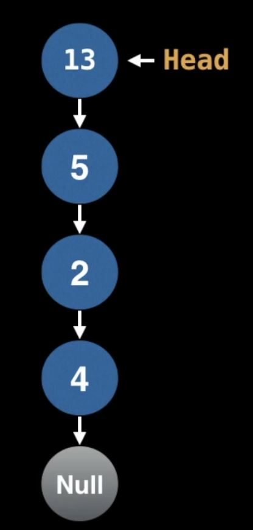

<center> 
<h1>Data Structures & Algorithms for Beginners - 2</h1> 
<h2>Stack</h2>
</center>

---

## A. Introduction to Stack

A stack is a one-ended linear data structure which models a real world stack by having two primary operations, namely **push** and **pop**.


### 1. Instructions

```java
pop();
push('Onion');
push('Celery');
push('Waltermelon');
pop();
pop();
push('Lettuce');
```


### 2. When & Where to use

- Used by undo mechanisms in text editors
- Used in compiler syntax checking for matching brackets and braces
- Can be used to model a pile of books or plates
- Used behind the scenes to support recursion by keeping track of previous function calls
- Can be used to do a Depth First Search (DFS) on a graph


### 3. Complexity

| Name      | Big O Notation |
| --------- | -------------- |
| Pushing   | O(1)           |
| Popping   | O(1)           |
| Peeking   | O(1)           |
| Searching | O(n)           |
| Size      | O(1)           |


### 4. Example - Brackets

| Brackets        | Valid or Not? |
| --------------- | ------------- |
| [ { } ]         | Valid         |
| ( ( ) ( ) )     | Valid         |
| { ]             | Invalid       |
| [ ( ) ] ) ) ( ) | Invalid       |
| [ ] { } ( { } ) | Valid         |


```
Let S be a stack
For bracket in bracket_string:
	rev = getReversedBracket(bracket)
	
	If isLeftBracket(bracket):
		S.push(bracket)
	
	Else If S.isEmpty() or S.pop() != rev:
		return false // Invalid
		
return S.isEmpty() // Valid if S is empty
```


## B. Stack Implementation

### 1. Pushing

Instructions

```java
push(4);
push(2);
push(5);
push(13);
```




### 2. Popping

Instructions

```java
pop();
pop();
pop();
pop();
```


## C. Stack Source Code

```java
import java.util.LinkedList;

public class Stack <T> implements Iterable <T> {
  private LinkedList <T> list = new LinkedList <T>();
  
  public Stack() { }
  
  public Stack(T firstElem) {
    push(firstElem);
  }
  
  public int size() {
    return list.size();
  }
  
  public boolean isEmpty() {
    return size() == 0;
  }
  
  public void push(T elem) {
    list.addLast(elem);
  }
  
  public T pop() {
    if (isEmpty()) {
      throw new java.util.EmptyStackException();
    }
    return list.removeLast();
  }
  
  public T peek() {
    if (isEmpty()) {
      throw new java.util.EmptyStackException();
    }
    return list.peekLast();
  }
  
  @Override public java.util.Iterator <T> iterator() {
    return list.iterator();
  }
  
}
```


