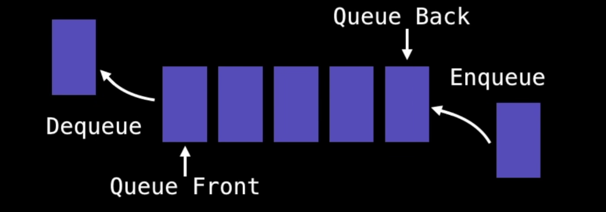
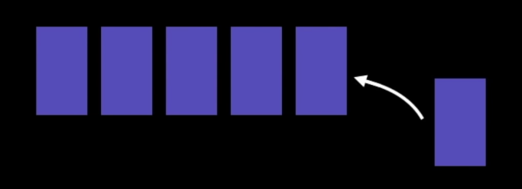
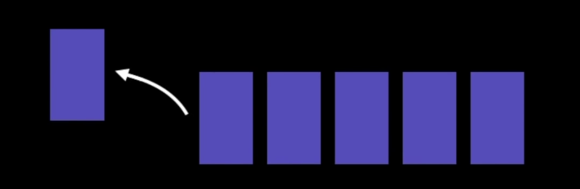
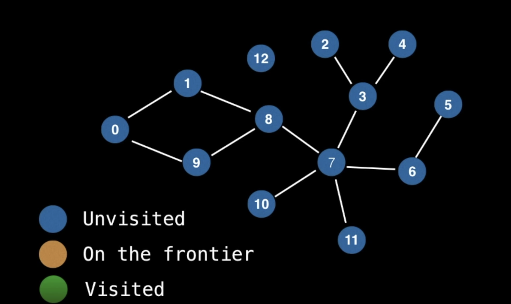
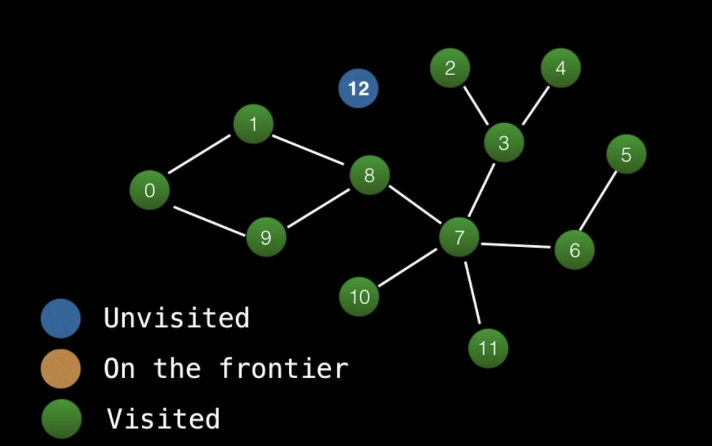

<center> 
<h1>Data Structures & Algorithms for Beginners - 3</h1> 
<h2>Queues</h2>
</center>


---

## A. Introduction to Queue

**Enqueue and Dequeue**: A queue is a linear data structure which models real world queues by having two primary operations

### Queue Terminology:




There does not seem to be consistent terminology for inserting and removing elements from queues.

### 1. Enqueue = Adding = Offering



### 2. Dequeue = Polling




## B. Simple Queue Example

### Instructions

```java
Enqueue(12); // add element (12) to the end
Dequeue(); // remove first element
Dequeue();
Enqueue(7);
Dequeue();
Enqueue(-6);
```


## C. When & Where

- Any waiting line models a queue, for example a lineup at a movie theatre.
- Can be used to efficiently keep track of the x most recently added elements.
- Web server request management where you want first come first serve.
- Breadth first search (BFS) graph traversal.


## D. Complexity Analysis

| Name of Queue Instruction | Big O Notation |
| :-----------------------: | :------------: |
|          Enqueue          |      O(1)      |
|          Dequeue          |      O(1)      |
|          Peeking          |      O(1)      |
|         Contains          |      O(n)      |
|          Removal          |      O(n)      |
|         Is Empty          |      O(1)      |


## E. Queue Example - Breadth First Search (BFS)





### 1. Pseudo-code:

```
Let Q be a Queue
Q.enqueue(starting_node)
starting_node.visited = true

While Q is not empty DO

	node = Q.dequeue()
	
	For neighbour in neighbours(node):
		If neighbour has not been visited:
			neighbour.visited = true
			Q.enqueue(neighbour)
```


### 2. Source Code for Queue

```java
public class Queue<T> implements Iterable<T> {
  private java.util.LinkedList <T> list = new java.util.LinkedList <T> ();
  public Queue() { } // create Queue
  public Queue(T firstElem) {
    offer(firstElem);
  }

  // Return the size of the queue
  public int size() {
    return list.size();
  }

  // Returns whether or not the queue is empty
  public boolean isEmpty() {
    return size() == 0;
  }

  // Peek the element at the front of the queue
  // The method throws an error is the queue is empty
  public T peek() {
    if (isEmpty()) throw new RuntimeException("Queue Empty");
    return list.peekFirst();
  }

  // Poll an element from the front of the queue
  // The method throws an error is the queue is empty
  public T poll() {
    if (isEmpty()) throw new RuntimeException("Queue Empty");
    return list.removeFirst();
  }

  // Add an element to the back of the queue
  public void offer(T elem) {
    list.addLast(elem);
  }

  // Return an iterator to alow the user to traverse
  // through the elements found inside the queue
  @Override
  public java.util.Iterator<T> iterator() {
    return list.iterator();
  }
}
```


