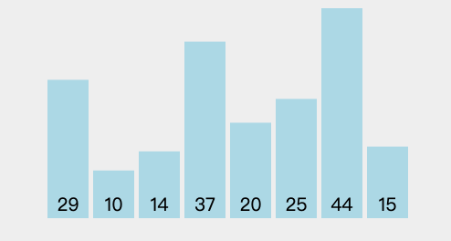
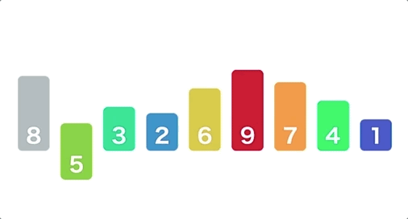
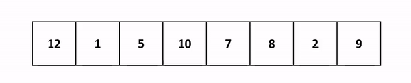
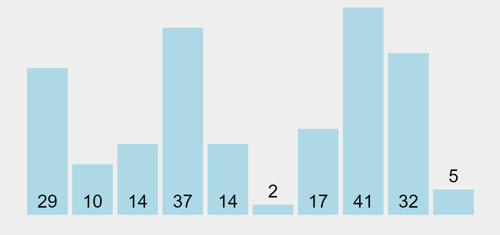
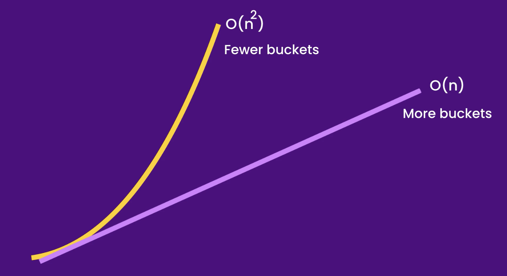

<center> 
<h1>Data Structures & Algorithms for Beginners - 4</h1> 
<h2>Sorting Algorithms</h2>
</center>


---

## A. Bubble Sorting


### 1. Time

|              | Best   | Worst     |
| ------------ | ------ | --------- |
| Passes       | O(1)   | O(n)      |
| Comparisions | O(n)   | O(n)      |
| **Total**    | O(n)   | O(n ^ 2)  |
|              | Linear | Quadratic |

### 2. Code

```java
public class bubbleSort {
    public void sort(int[] array) {
        boolean isSorted;

        for (var i = 0; i < array.length; i++) {
            isSorted = true;
            for (var j = 1; j < array.length - i; j++) {
                if (array[j] < array[j - 1]) {
                    swap(array, j, j - 1);
                    isSorted = false;
                }
            }
            if (isSorted) {
                return;
            }
        }
    }

    private void swap(int[] array, int index1, int index2) {
        var temp = array[index1];
        array[index1] = array[index2];
        array[index2] = temp;
    }
}
```


## B. Selection Sorting



### 1. Time

|              | Best      | Worst     |
| ------------ | --------- | --------- |
| Passes       | O(n)      | O(n)      |
| Comparisions | O(n)      | O(n)      |
| **Total**    | O(n ^ 2)  | O(n ^ 2)  |
|              | Quadratic | Quadratic |

### 

### 2. Code

```java
public class selectionSort {
    public void sort(int[] array) {
        for (var i = 0; i < array.length; i++) {
            var minIndex = i;
            for (var j = i; j < array.length; j++) {
                if (array[j] < array[minIndex]) {
                    minIndex = j;
                }
            }
            swap(array, minIndex, i);
        }
    }

    private void swap(int[] array, int index1, int index2) {
        var temp = array[index1];
        array[index1] = array[index2];
        array[index2] = temp;
    }
}
```


## C. Insertion Sorting



### 1. Time

|              | Best   | Worst     |
| ------------ | ------ | --------- |
| Passes       | O(n)   | O(n)      |
| Comparisions | O(1)   | O(n)      |
| **Total**    | O(n)   | O(n ^ 2)  |
|              | Linear | Quadratic |

### 

### 2. Code

```java
public class insertionSort {
    public void sort(int[] array) {
        for (var i = 1; i < array.length; i++) {
            var current = array[i];
            var j = i - 1;
            while (j >= 0 && array[j] > current) {
                array[j + 1] = array[j];
                j--;
            }
            array[j + 1] = current;
        }
    }
}
```


## D. Merge Sorting



### 1. Time

|           | Best       | Worst      |
| --------- | ---------- | ---------- |
| Dividing  | O(log n)   | O(log n)   |
| Merging   | O(n)       | O(n)       |
| **Total** | O(n log n) | O(n log n) |
| Space     | O(n)       | O(n)       |

### 

### 2. Code

```java
public class mergeSort {
    public void sort(int[] array){
        if (array.length < 2) {
            return;
        }

        var middle = array.length / 2;

        int[] left = new int[middle];
        for (var i = 0; i < middle; i++) {
            left[i] = array[i];
        }

        int[] right = new int[array.length - middle];
        for (var j = middle; j < array.length; j++) {
            right[j - middle] = array[j];
        }

        sort(left);
        sort(right);

        merge(left, right, array);
    }

    private void merge(int[] left, int[] right, int[] result) {
        int i = 0;
        int j = 0;
        int k = 0;

        while (i < left.length && j < right.length) {
            if (left[i] <= right[j]) {
                result[k++] = left[i++];
            } else {
                result[k++] = right[j++];
            }
        }

        while (i < left.length) {
            result[k++] = left[i++];
        }

        while (j < right.length) {
            result[k++] = right[j++];
        }
    }
}
```


## E. Quick Sorting



### 1. Time

|              | Best       | Worst    |
| ------------ | ---------- | -------- |
| Partitioning | O(n)       | O(n)     |
| # of times   | O(log n)   | O(n)     |
| **Total**    | O(n log n) | O(n ^ 2) |
| Space        | O(log n)   | O(n)     |

### 

### 2. Code

```java
public class quickSort {
    public void sort(int[] array) {
        sort(array, 0, array.length - 1);
    }
    private void sort(int[] array, int start, int end) {
        if (start >= end) {
            return;
        }


        var boundary = partition(array, start, end);

        sort(array, start, boundary - 1);
        sort(array, boundary + 1, end);
    }

    private int partition(int[] array, int start, int end) {
        var pivot = array[end];
        var boundary = start - 1;
        for (var i = start; i <= end; i++) {
            if (array[i] <= pivot) {
                swap(array, i, ++boundary);
            }
        }
        return boundary;
    }

    private void swap(int[] array, int index1, int index2) {
        var temp = array[index1];
        array[index1] = array[index2];
        array[index2] = temp;
    }
}
```


## F. Counting Sorting


### 1. Time

Space: O(k)

| Time:           |          |
| --------------- | -------- |
| Populate Counts | O(n)     |
| Iterate Counts  | O(k)     |
| **Total**       | O(n + k) |
|                 | Linear   |

### 

### 2. Code

```java
public class countingSort {
    public void sort(int[] array, int max) {
        int[] counts = new int[max + 1];
        for (var item : array) {
            counts[item]++;
        }

        var k = 0;
        for (var i = 0; i < counts.length; i++) {
            for (var j = 0; j <counts[i]; j++) {
                array[k++] = i;
            }
        }
    }
}
```


## G. Bucket Sorting


### 1. Time

Space: O(n + k)

|                   | Best     | Worst        |
| ----------------- | -------- | ------------ |
| Distribution      | O(n)     | O(n)         |
| Iterating Buckets | O(k)     | O(k)         |
| Sorting           | O(1)     | O(n ^ 2)     |
| **Total**         | O(n + k) | O(n ^ 2 + k) |




### 2. Code

```java
import java.util.ArrayList;
import java.util.Collection;
import java.util.Collections;
import java.util.List;

public class bucketSort {
    public void sort(int[] array, int numberOfBuckets) {
        var buckets = createBuckets(array, numberOfBuckets);

        var i = 0;

        for (var bucket : buckets) {
           Collections.sort(bucket);
           for (var item : bucket) {
               array[i++] = item;
           }
        }
    }

    private List<List<Integer>> createBuckets(int[] array, int numberOfBuckets) {
        List<List<Integer>> buckets = new ArrayList<>();

        for (var i = 0; i < numberOfBuckets; i++) {
            buckets.add(new ArrayList<>());
        }

        for (var item : array) {
            buckets.get(item / numberOfBuckets).add(item);
        }

        return buckets;
    }
}
```


