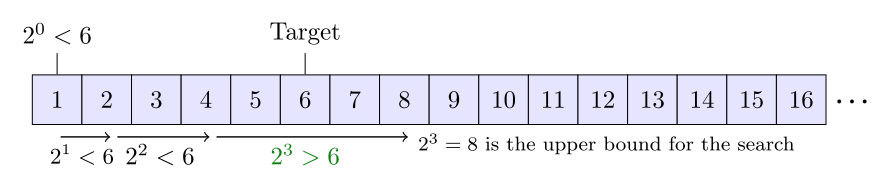

<center> 
<h1>Data Structures & Algorithms for Beginners - 5</h1> 
<h2>Searching Algorithms</h2>
</center>


---

## A. Linear Search


### 1. Time

|                     | Best | Worst |
| ------------------- | ---- | ----- |
| **Time Complexity** | O(1) | O(n)  |


### 2. Code

#### 2.1 Example for Int

```java
public class LinearSearch {
    public int search(int[] array, int target) {
        int count = 0;
        for (int i = 0; i < array.length; i++) {
            if (array[i] == target) {
                break;
            }
            count++;
        }
        return count;
    }
}

public class Main {
    public static void main(String[] args) {
        System.out.println("Linear Searching: ");
        LinearSearch lsearch = new LinearSearch();
        int[] numbers = { 7, 3, 1, 4, 6, 2 };
        int target = 3;
        var Index= lsearch.search(numbers, target);
        System.out.println("Index of " + target + ": " + Index);
    }
}
```

#### 2.2 Example for String

```java
public class LinearSearch {
    public void search(String[] name, String[] phoneNum, String target) {
        for (int i = 0; i < name.length; i++) {
            if (name[i].equals(target)) {
                System.out.println("Found");
                System.out.println("People: " + target);
                System.out.println("Phone Number: " + phoneNum[i]);
                return;
            }
        }
        System.out.println("Not Found");
        return;
    }
}

public class Main {
    public static void main(String[] args) {
        System.out.println("--- Linear Search ---");
        String name[] = {"Bill", "David"};
        String phoneNum[] = {"64253245", "66618751"};
        String target = "David";
        LinearSearch lsearch = new LinearSearch();
        lsearch.search(name, phoneNum, target);
        System.out.println();
    }
}
```


## B. Binary Search


### 1. Time

|                      | Recursive | **Lterative** |
| -------------------- | --------- | ------------- |
| **Time Complexity**  | O(log n)  |               |
| **Space Complexity** | O(log n)  | O(1)          |


### 2. Code

#### 2.1 Example for Int

```java
public class BinarySearch {

    public int RecursiveBinarySearch(int[] array, int target) {
        return RecursiveBinarySearch(array, target, 0, array.length - 1);
    }

    public int RecursiveBinarySearch(int[] array, int target, int left, int right) {

        if (right < left) {
            return -1;
        }

        int middle = (left + right) / 2;

        if (array[middle] == target) {
            return middle;
        }

        if (target < array[middle]) {
            return RecursiveBinarySearch(array, target, left, middle - 1);
        }

        return RecursiveBinarySearch(array, target, middle + 1, right);
    }

    public int IterativeBinarySearch(int[] array, int target) {
        var left = 0;
        var right = array.length - 1;

        while (left <= right) {
            var middle = (left + right) / 2;

            if (array[middle] == target) {
                return middle;
            }

            if (target < array[middle]) {
                return middle - 1;
            } else {
                left = middle + 1;
            }
        }
        return -1;
    }
}

public class Main {
    public static void main(String[] args) {
        System.out.println();
        System.out.println("Binary Searching (Recursive): ");
        BinarySearch bsearch = new BinarySearch();
        int[] numbers1 = { 1, 2, 3, 4, 5, 6 };
        int target1 = 3;
        var Index1 = bsearch.RecursiveBinarySearch(numbers1, target1);
        System.out.println("Index of " + target1 + ": " + Index1);
      
      System.out.println();
        System.out.println("Binary Searching (Iterative): ");
        BinarySearch bsearch1 = new BinarySearch();
        int[] numbers2 = { 1, 2, 3, 4, 5, 6 };
        int target2 = 3;
        var Index2 = bsearch1.IterativeBinarySearch(numbers2, target2);
        System.out.println("Index of " + target2 + ": " + Index2);
    }
}
```


#### 2.2 Example for String

```java
public class BinarySearch {
    public void search(String[] name, String[] phoneNum, String target) {
        int middle = name.length / 2;

        if (name.length == 0) {
            System.out.println("Empty");
            return;
        }

        if (name[middle].equals(target)) {
            System.out.println("Found");
            System.out.println("People: " + target);
            System.out.println("Phone Number: " + phoneNum[middle]);
            return;
        }

        for (int i = 0; 0 < (middle - 1); i++) {
            if (name[i].equals(target)) {
                System.out.println("Found");
                System.out.println("People: " + target);
                System.out.println("Phone Number: " + phoneNum[i]);
                return;
            }
            System.out.println("Not Found");
            return;
        }

        for (int i = middle + 1; i < name.length; i++) {
            if (name[i].equals(target)) {
                System.out.println("Found");
                System.out.println("People: " + target);
                System.out.println("Phone Number: " + phoneNum[i]);
                return;
            }
            System.out.println("Not Found");
            return;
        }
    }
}

public class Main {
    public static void main(String[] args) {
        System.out.println("--- Binary Search ---");
        String name1[] = {"Bill", "David", "Tom", "Tommy", "Neo", "Nash", "Alica", "Bob", "Frank", "Cris"};
        String phoneNum1[] = {"64253245", "66618751", "63254323", "43241443", "32313134", "67344114", "68921329", "13454353", "63561775", "97461324"};
        String target1 = "Bill";
        BinarySearch bsearch = new BinarySearch();
        bsearch.search(name1, phoneNum1, target1);
        System.out.println();
    }
}
```


## C. Ternary Search


### 1. Time

|                     | Big O Notation |
| ------------------- | -------------- |
| **Time Complexity** | O(log 3 n)     |


### 2. Code

#### 2.1 Example for Int

```java
public class TernarySearch {
    public int search(int[] array, int target) {
        return search(array, target, 0, array.length - 1);
    }

    private int search(int[] array, int target, int left, int right) {
        int partitionSize = (right - left) / 3;
        int mid1 = left + partitionSize;
        int mid2 = right - partitionSize;

        if (left > right) {
            return -1;
        }

        if (array[mid1] == target) {
            return mid1;
        }

        if (array[mid2] == target) {
            return mid2;
        }

        if (target < array[mid1]) {
            return search(array, target, left, mid1 - 1);
        }

        if (target > array[mid2]) {
            return search(array, target, mid2 + 1,right);
        }

        return search(array, target, mid1 + 1, mid2 - 1);
    }
}

public class Main {
    public static void main(String[] args) {
        System.out.println();
        System.out.println("Ternary Searching: ");
        TernarySearch tsearch = new TernarySearch();
        int[] numbers3 = { 7, 3, 1, 4, 6, 2 };
        int target3 = 3;
        var Index3 = tsearch.search(numbers3, target3);
        System.out.println("Index of " + target3 + ": " + Index3);
    }
}
```


#### 2.2 Example for String

```java
public class BinarySearch {
    public void search(String[] name, String[] phoneNum, String target) {
        int middle = name.length / 2;

        if (name.length == 0) {
            System.out.println("Empty");
            return;
        }

        if (name[middle].equals(target)) {
            System.out.println("Found");
            System.out.println("People: " + target);
            System.out.println("Phone Number: " + phoneNum[middle]);
            return;
        }

        for (int i = 0; 0 < (middle - 1); i++) {
            if (name[i].equals(target)) {
                System.out.println("Found");
                System.out.println("People: " + target);
                System.out.println("Phone Number: " + phoneNum[i]);
                return;
            }
            System.out.println("Not Found");
            return;
        }

        for (int i = middle + 1; i < name.length; i++) {
            if (name[i].equals(target)) {
                System.out.println("Found");
                System.out.println("People: " + target);
                System.out.println("Phone Number: " + phoneNum[i]);
                return;
            }
            System.out.println("Not Found");
            return;
        }

    }
}

public class Main {
    public static void main(String[] args) {
        System.out.println("--- Ternary Search ---");
        String name2[] = {"Bill", "David", "Tom", "Tommy", "Neo", "Nash", "Alica", "Bob", "Frank", "Cris"};
        String phoneNum2[] = {"64253245", "66618751", "63254323", "43241443", "32313134", "67344114", "68921329", "13454353", "63561775", "97461324"};
        String target2 = "Tom";
        TernarySearch tsearch = new TernarySearch();
        tsearch.search(name2, phoneNum2, target2);
        System.out.println();
    }
}
```


## D. Jump Search


### 1. Time

|                     | Big O Notation |
| ------------------- | -------------- |
| **Time Complexity** | O(√n)          |


### 2. Code

```java
public class JumpSearch {
    public int search(int[] array, int target) {
        int blocksize = (int) Math.sqrt(array.length);
        int start = 0;
        int next = blocksize;

        while (start < array.length && array[next - 1] < target) {
            start = next;
            next += blocksize;

            if (next > array.length) {
                next = array.length;
            }
        }

        for (var i = start; i < next; i++) {
            if (array[i] == target) {
                return i;
            }
        }
        return -1;
    }
}

public class Main {
    public static void main(String[] args) {
        System.out.println();
        System.out.println("Jump Searching: ");
        JumpSearch jsearch = new JumpSearch();
        int[] numbers4 = { 7, 3, 1, 4, 6, 2 };
        int target4 = 3;
        var Index4 = jsearch.search(numbers4, target4);
        System.out.println("Index of " + target4 + ": " + Index4);
    }
}
```


## E. Exponential Search



### 1. Time

|                     | Big O Notation |
| ------------------- | -------------- |
| **Time Complexity** | O(log i)       |


### 2. Code (Need use Binary Search (Recursive))

```java
public class ExponentialSearch {
    BinarySearch bsearch = new BinarySearch();
    public int search(int[] array, int target) {
        int bound = 1;
        while (bound < array.length && array[bound] < target) {
            bound *= 2;
        }
        int left = bound / 2;
        int right = Math.min(bound, array.length - 1);

        return bsearch.RecursiveBinarySearch(array, target, left, right);
    }
}

public class Main {
    public static void main(String[] args) {
        System.out.println();
        System.out.println("Exponential Searching: ");
        ExponentialSearch esearch = new ExponentialSearch();
        int[] numbers5 = { 1, 2, 3, 4, 5, 6 };
        int target5 = 3;
        var Index5 = esearch.search(numbers5, target5);
        System.out.println("Index of " + target5 + ": " + Index5);
    }
}
```


