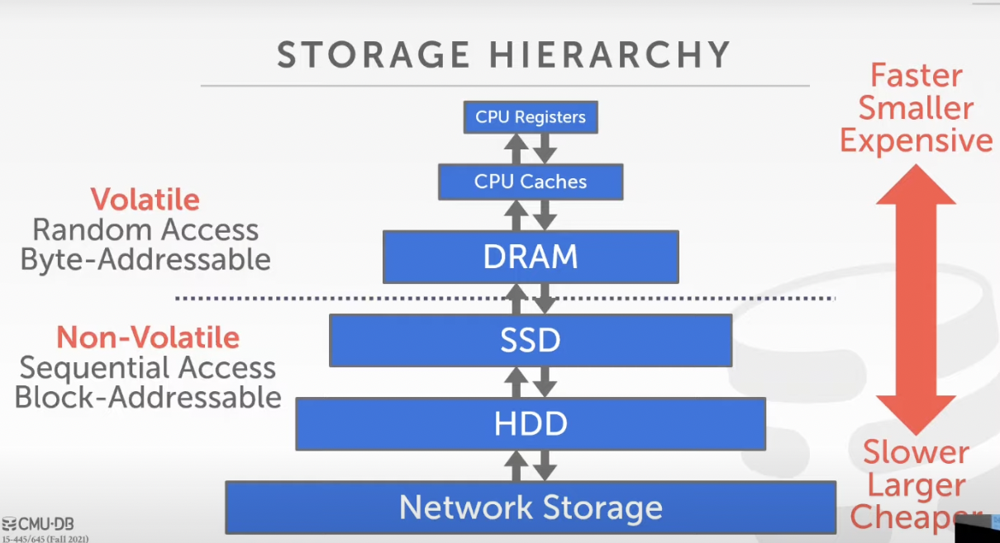
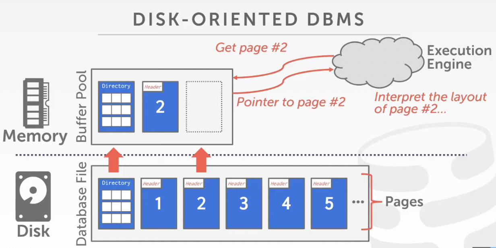
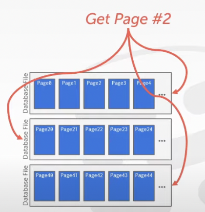
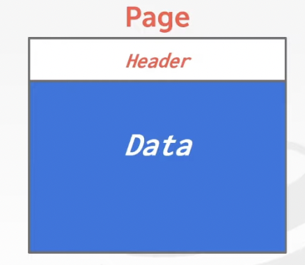
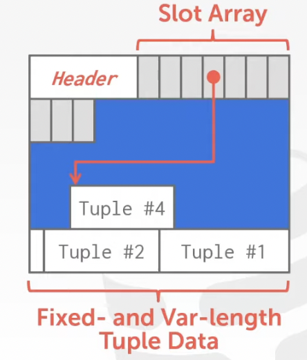
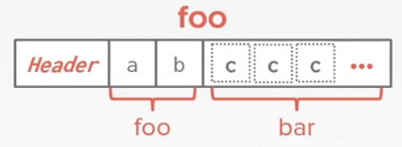

<center>
  <h1>Database System Basic - 2 </h1>
  <h2>Database Storage I (File Storage + Page Layout + Tuple Layout)</h2>
</center>


---

## A. Disk-Based Architecture

**DBMS** assums that the primary storage location of the database is on **non-volatile disk**.

DBMS's components manage the movement of data between **non-volatile disk** and **volatile disk**.


## B. Storgae Hierarchy

### 1. kinds of Storage



### 2. Access Times

|       Time       | Storgae Hierarchy | Time (changed) |
| :--------------: | :---------------: | :------------: |
|      0.5 ns      |   L1 Cache Ref    |    0.5 sec     |
|       7 ns       |   L2 Cache Ref    |     7 sec      |
|      100 ns      |       DRAM        |    100 sec     |
|    150,000 ns    |        SSD        |    1.7 days    |
|  10,000,000 ns   |        HDD        |   16.5 weeks   |
| ~ 30,000,000 ns  |  Network Storage  |  11.4 months   |
| 1,000,000,000 ns |   Tape Archives   |   31.7 years   |


## C. Sequential VS. Random Access

**For non-volatile**: running time (usually) ==> Random access < Sequential access

**DBMS** want to **maximize Sequential access**


## D. Disk-oriented DBMS




## E. File Storage

The DBMS stores a database as one or more files on disk typically in a proprietary format.


### 1. Storage Manager

**Storage Manager**: Responsible for maintaining a database's file.


It organizes the files as a collection of **pages**.

--> Tracks data read / written to pages

--> Tracks the available space


### 2. Database Pages

**Page**: A fixed-size block of data (Some systems require a page to be self-contained)

Each page is given a **unique identifier** (page IDs --> Physical locations)

| Types                                                        | Size          |
| ------------------------------------------------------------ | ------------- |
| Hardware Page (the largest block of data that the device can guarantee failsafe write) | usually 4 KB  |
| OS Page                                                      | usually 4 KB  |
| Database Page                                                | 512 B - 16 KB |


### 3. Database Heap

**Heap File**: An unordered collection of pages with tuples that are stored in random order.

--> Create / Get / Write / Delete Page & support iterating over all pages

**Represent a heap file**:

--> Linked List

--> Page Directory

For example: (Track Multiple files)



#### a). Heap File: Linked List

Maintain a **header page** at the beginning of the file that stores two pointers:

--> HEAD of the **free page list**

--> HEAD of the **data page list**

Each page keeps **track** of how many **free slots** they currently have.

For example:


#### b). Heap File: Page Directory

DBMS maintains special pages that tracks the location of data pages in the database file.

The directory also records **the number of free slots of per page**.

(P.s. the directory pages are in sync with the data pages)


### 4. Page Header

Every page contains a **header** of meta-data about the page's contents

--> Page Size

--> Checksum

--> DBMS Version

--> Transaction Visibility

--> Compression Information

For example:




## F. Page Layout

Two approaches:

--> Tuple-oriented

--> Log-structured


### 1. Tuple Storage

**Strawman Idea**: Keep track of the number of tuples in a page and then just append a new tuples to the end.

For example:

<center><h3><b>Page</b></h3></center>

| *Num Tuples = 3* |
| :--------------: |
|     Tuple #1     |
|     Tuple #4     |
|     Tuple #3     |
|                  |


### 2. Slotted Pages

The slot array maps "slots" to the tuples' starting position offsets

The header keeps strack of:

--> The # of used slots

--> The offset of the starting location of the last slot used

For example:




### 3. Record IDs

Each tuple is assigned a unique record identifier.

--> Most common: **page_id + offset / slot**

--> Can also contain file location info


## G. Tuple Layout

**Tuple**: Essentially a sequence of bytes


### 1. Tuple Header

Each tuple is prefixed with a **header** that contains meta-data about it.

--> Visibility info (concurrency control)

--> Bit Map for NULL values


### 2. Tuple Data

Attributes are typically stored in the order that you specify them when you create the table.

<center><h3><b>Tuple</b></h3></center>

| Header |  a   |  b   |  c   |  d   |  e   |
| :----: | :--: | :--: | :--: | :--: | :--: |
|  ...   | ...  | ...  | ...  | ...  | ...  |

```sql
CREATE TABLE foo (
	a INT PRIMARY KEY,
  b INT NOT NULL,
  c INT,
  d DOUBLE,
  e FLOAT
)
```


### 3. Denormalized Tuple Data

DBMS can physically ***denormalize*** related tuples and store them together in the same page.

--> Reduces the amount of I/O for common workload patterns

--> Can make updates more expersive

```sql
CREATE TABLE foo (
	a INT PRIMARY KEY,
  b INT NOT NULL,
);
```

```sql
CREATE TABLE foo (
	c INT PRIMARY KEY,
  a INT
  	REFERENCE foo (a),
);
```

For example:




