<center>
  <h1><b>Database System Basic - 3 </b></h1>
  <h2>Database Storage II</h2>
</center>

---

<center><h1>Page Base Storage</h1></center>

---

## A. Disk-oriented Architecture

The DBMS assumes that the primary storage location of the database is on non-volatile disk.

The DBMS's components manage the movement of data between non-volatile and volatile storage.


## B. Log-structured File Organization

Instead of storing tuples in pages, the DBMS only stores **log records**

### 1. Update / Write Log

The system appends log records to the file of how the database was modified:

--> Inserts store the entire tuple

--> Deletes mark the tuple as deleted

--> Updates contain the delta of just the attributes that were modified

For example:

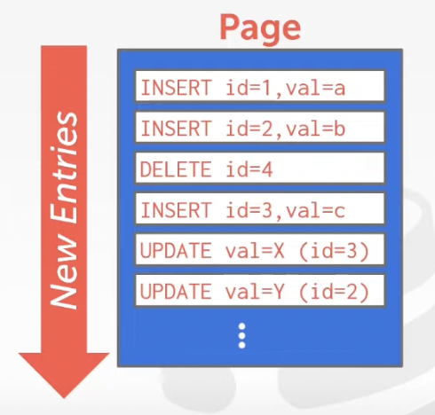


### 2. Read

#### a) To read a record, the DBMS scans the log backwards and "recreates" the tuple to find what it needs

For example: 

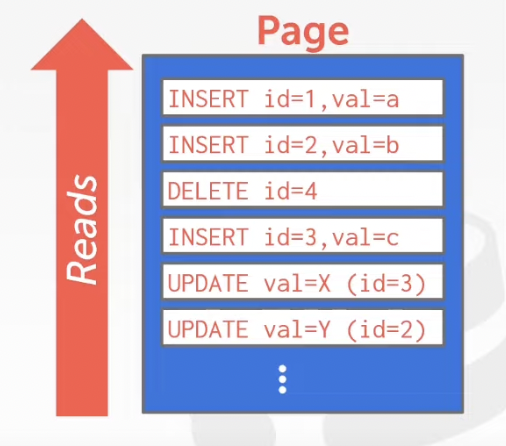

#### b) Build index to allow it to jump to location in the log

For example:

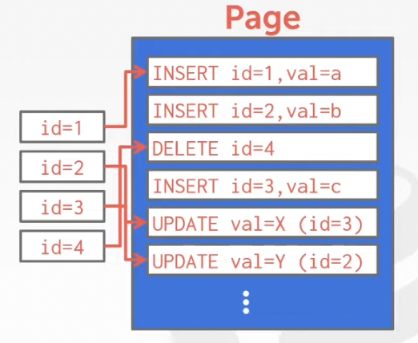

### c) Periodically compact the log

For example:

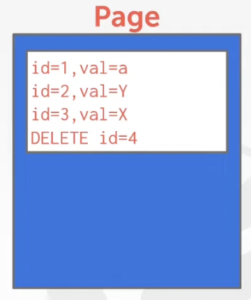


## C. Log-structured Compaction

Compaction coalesces larger log files into smaller files by removing unnecessary records


| Level Compaction                                             | Universal Compaction                                         |
| ------------------------------------------------------------ | ------------------------------------------------------------ |
| 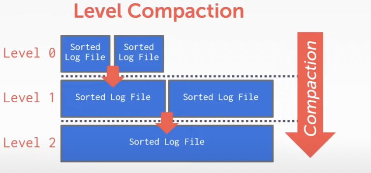 | 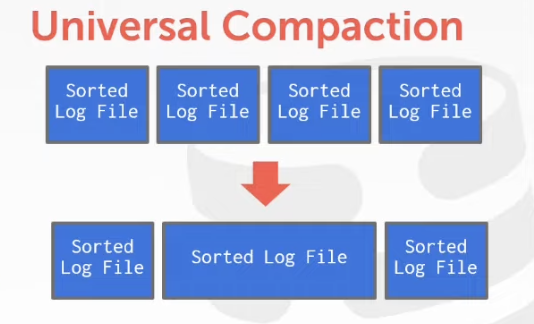 |


<center><h1>Data Resentation</h1></center>

---

**INTEGER / BIGINT / SMALLINT / TINYINT**

--> C / C++ Representation

**FLOAR / REAL vs. NUMERIC / DECIMAL**

--> IEEE-754 Standard / Fixed-point Decimals

**VARCHAR / VARBINARY / TEXT / BLOB**

--> Header with length, followed by data bytes

**TIME / DATE / TIMESTAMP**

--> 32 / 64-bit integer of (micro) seconds since Unix epoch


## A. Variable Precision Numbers

Inexact, variable-precision numeric type that uses the "native" C / C++ types

--> Ex: FLOAT / REAL / DOUBLE

### Example:

```c
#include <stdio.h>

int main(int argc, char* argv[]) {
  float x = 0.1;
  float y = 0.2;
  printf("x + y = %f\n", x + y);
  printf("0.3 = %f\n", 0.3);
}

// output: 
// x + y = 0.300000
// 0.3 = 0.300000
```

```c
#include <stdio.h>

int main(int argc, char* argv[]) {
  float x = 0.1;
  float y = 0.2;
  printf("x + y = %.20f\n", x + y);
  printf("0.3 = %.20f\n", 0.3);
}

// output: 
// x + y = 0.30000001192092895508
// 0.3 = 0.29999999999999998890
```


## B. Fixed Precision Numbers

Numeric data types with arbitrary precision and scale. Used when rounding errors are unacceptable

--> Ex. NUMERIC / DECIMAL

Many different implementations


### 1. Postgres: Numeric

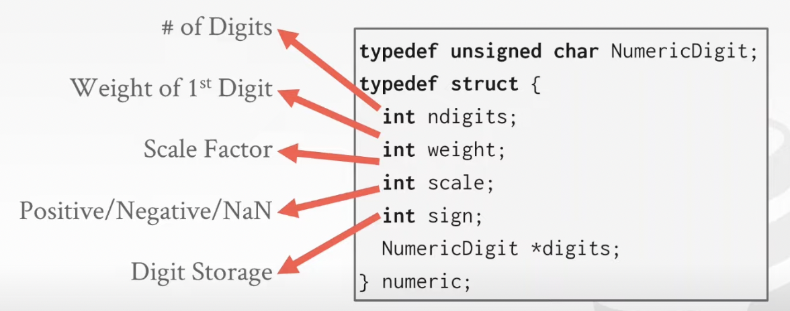


### 2. MySQL: Numeric

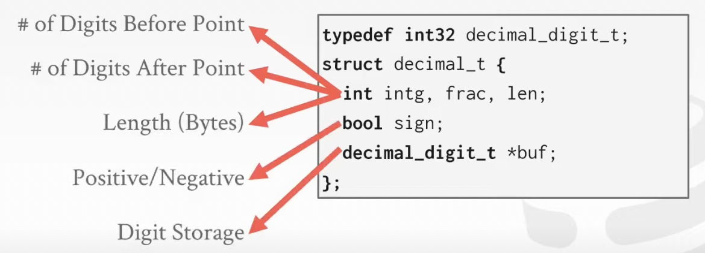


## C. Large Values

Most DBMSs don't allow a tuple to exceed the size of a single page.

To store values that are larger than a page, the DBMS uses separate overflow **storage** pages.

--> Postgres: TOAST (> 2 KB)

--> MySQL: Overflow (> 1/2 size of page)

--> SQL Server: Overflow (> size of page)

Example:

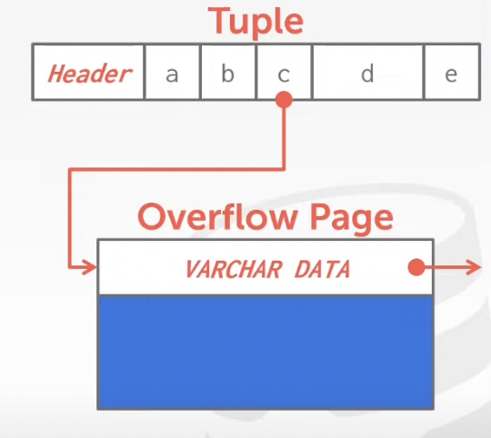


## D. External Value Storage

Some systems allow you to store a really large value in an external file. Treated as a **BLOB** type. (Oracle & Microsoft)

The DBMS cannot manipulate the contents of an external file

Example:

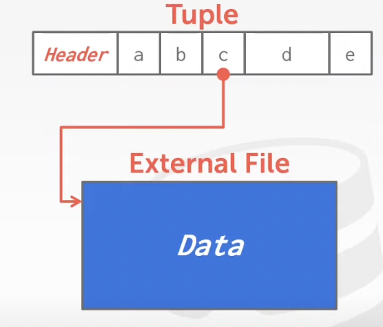


<center><h1>System Catalogs</h1></center>

---

A DBMS store meta-data about databases in its internal catalogs

--> Tables, columns, indexes, views

--> Users, permissions

--> Internal statistics

Almost every DBMS stores the database's catalog inside itself

--> Wrap object abstractuon around tuples


You can query the DBMS's internal **INFORMATION_SCHEMA** catalog to get info about the database

--> ANSI standard set of read-only views that provide info about all the tables, views, columns, and procedures in a database


## A. Accessing Table Schema

For example: <db name> = student

SQL-92:

```sql
SELECT *
	FROM INFORMATION_SCHEMA.TABLES
	WHERE table_name = 'student';
```

Postgres:

```sql
\d student;
```

MySQL:

```mysql
DESCRIBE student;
```

SQLite:

```sqlite
.schema student
```


## B. Database Workloads

#### 1. On-line Transaction Processing (OLTP)

--> Fast operations that only read / update a small amount of data each time

#### 2. On-line Analytical Processing (OLAP)

--> Complex queries that read a lot of data to compute aggregates

#### 3. Hybrid Transaction + Analytical Processing

--> OLTP + OLAP together on the same database instance


**Graph**:

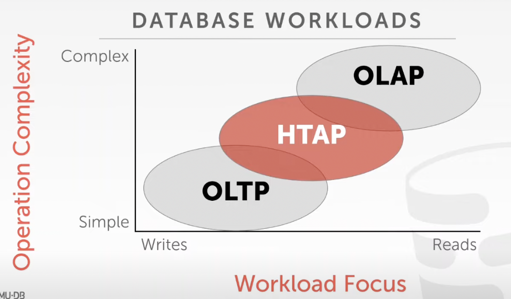

### 1. Bifurcated Environment

#### 1. OLTP ----> OLAP

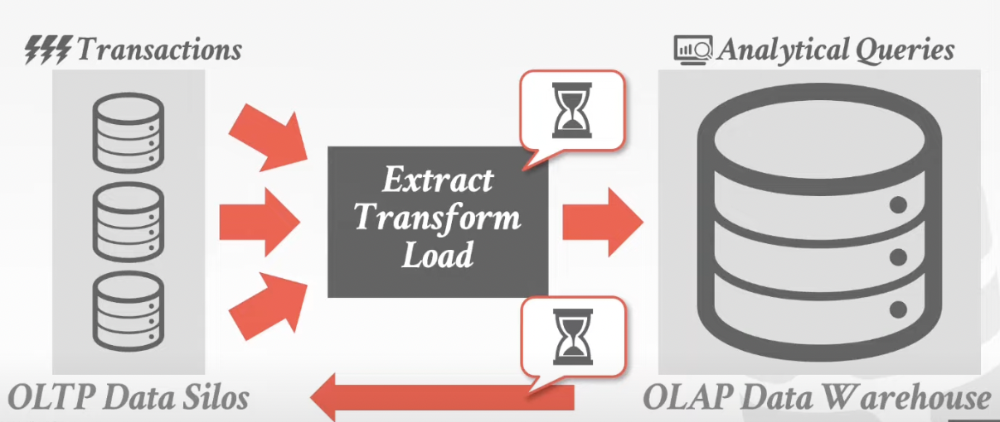

#### 2.HTAP ----> OLAP

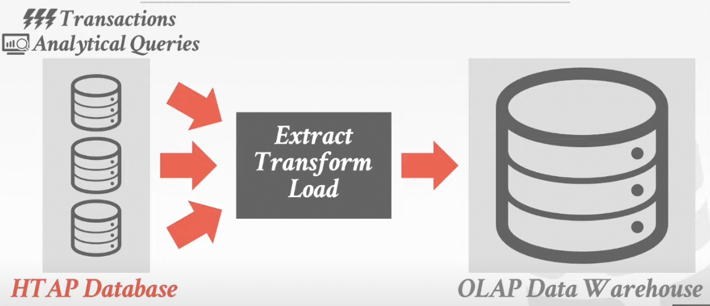


### 2. Wikipedia Example

```sql
CREATE TABLE useracct (
	userID INT PRIMARY KEY,
  userName VARCHAR UNIQUE,
  ...
);
```

```sql
CREATE TABLE pages (
	pageID INT PRIMARY KEY,
  title VARCHAR UNIQUE,
  latest INT
  	REFERENCES revisions (revID),
);
```

```sql
CREATE TABLE revisions (
	revID INT PRIMARY KEY,
  userID INT REFERENCES useracct (userID),
  pageID INT REFERENCES pages (pageID),
  content TEXT,
  updated DATATIME
);
```


### 3. OLTP

On-line Transaction Processing (OLTP)

---> Simple queries that read / update a small amount of data that is related to a single entity in the database

```sql
SELECT P.*, R.*
	FROM pages AS P
	INNER JOIN revisions AS P
	ON P.latest = R.revID
	WHERE P.pageID = ?
```

```sql
UPDATE useracct
	SET lastLogin = NOW(),
		hostname = ?
	WHERE userID = ?
```

```sql
INSERT INTO revisions
VALUES (?, ?..., ?)
```


### 4. OLAP

On-line Analytical Processing (OLAP)

--> Complex queries that read large portions of the database spanning multiple entites

```sql
SELECT COUNT(U.lastLogin),
	EXTRACT(month FROM
         U.lastLogin) AS month
  FROM useracct AS U
  WHERE U.hostname LIKE '%.gov'
  GROUP BY
  EXTRACT(month FROM U.lastLogin)
```


<center><h1>Data Storage Models</h1></center>

---

The DBMS can store tuples in different ways that are better for either OLTP or OLAP workloads


## A. N-Ary Storage Model (NSM)

The DBMS stores all attributes for a single tuple contiguously in a page

Ideal for OLTP workload where queries tend to operate only on an individual entity and insertheavy workloads

The DBMS stores all attributes for a single tuple contiguosly in a page

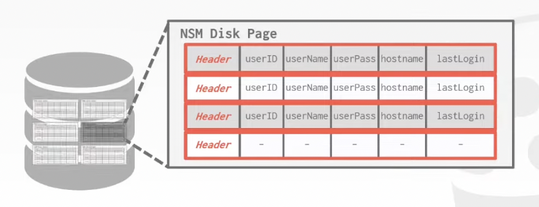

**Example**:

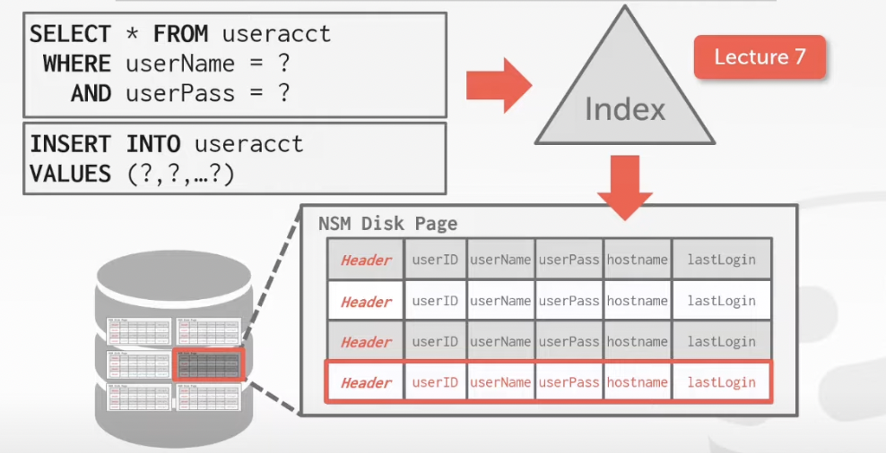

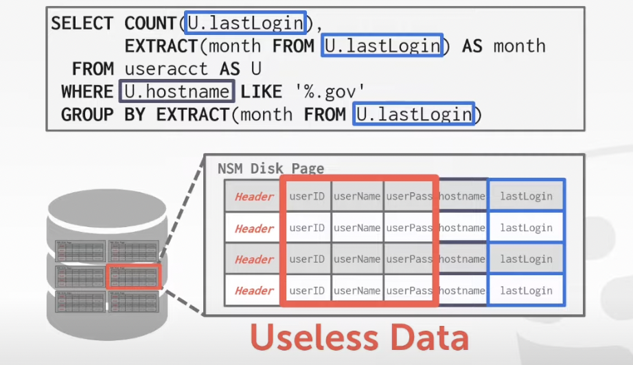


| Advantages                                    | Disadvantages                                                |
| --------------------------------------------- | ------------------------------------------------------------ |
| - Fast inserts, updates, and deletes          | - Not good for scanning large portions of the table and / or a subsetof the attributes |
| - Good for queries that need the entire tuple |                                                              |


## B. Decomposition Storage Model (DSM)

The DBMS stores the values of a single attribute for all tuples contiguously in a page

Ideal for OLAP workload where read-only queries perform large scans over a subset of the table's attributes

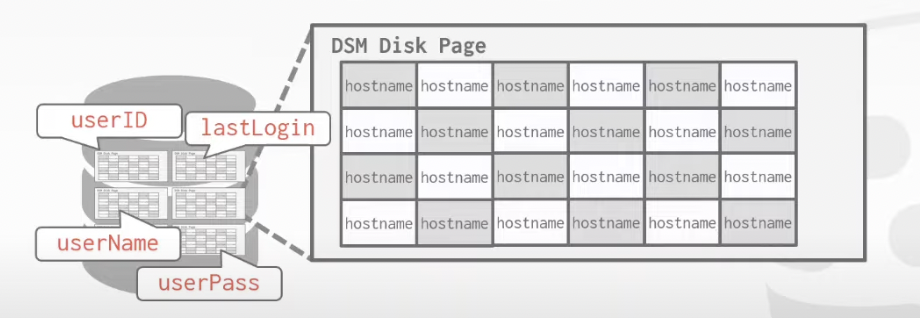

### 1. **Example**:

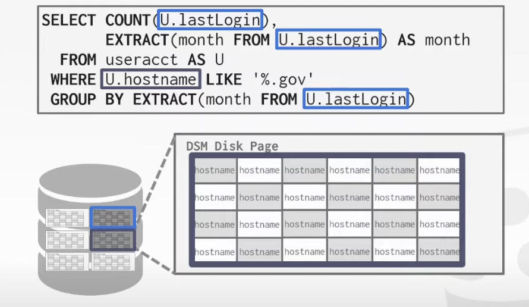

### 2. Tuple Identification

#### Choice #1: Fixed-length Offsets

--> Each value is the same length for an attribute

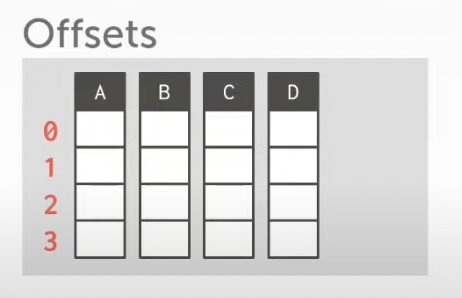


#### Choice #2: Embedded Tuple Ids

--> Each value is stored with its tuple id in a column

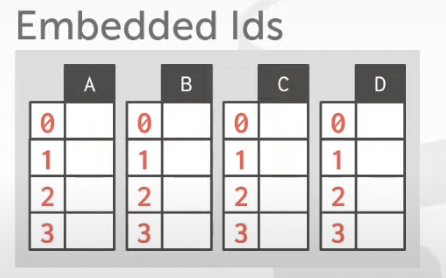


### 3. Advantages vs. Disadvantages

| Advantages                                                   | Disadvantages                                                |
| ------------------------------------------------------------ | ------------------------------------------------------------ |
| - Reduces the amount wasted I / O because the DBMS only reads the data that it needs | - Slow for point queries, inserts, updates, and deletes because of tuple splitting / stitching |
| - Better query processing and data compression               |                                                              |


